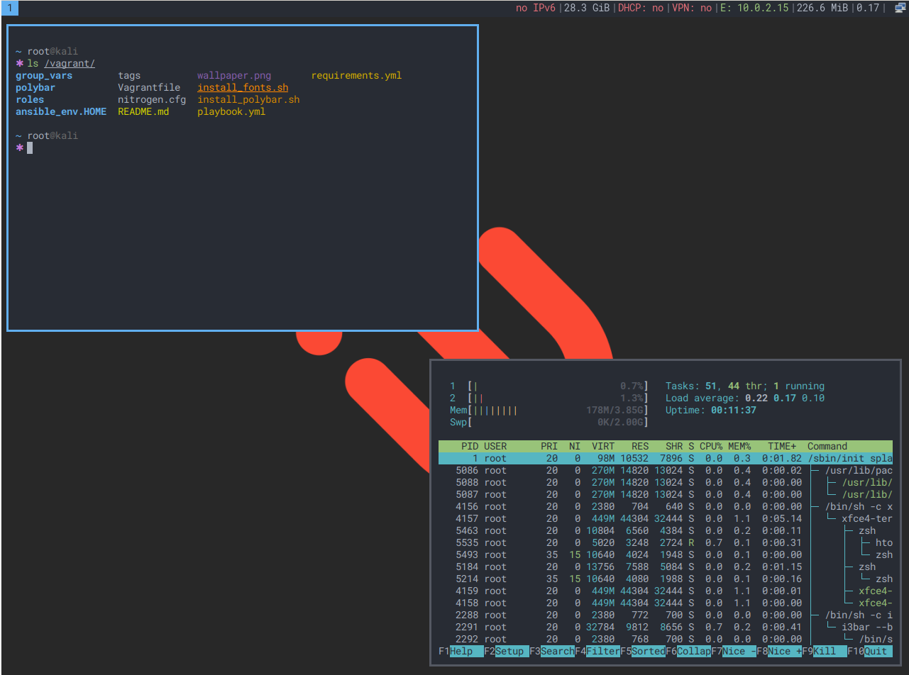

# [i3](https://i3wm.org/) Kali Linux Vagrant

Create a [Kali](https://www.kali.org/) virtual machine with the
[i3](https://i3wm.org) window manager using [vagrant](https://www.vagrantup.com)
and [ansible](https://www.ansible.com)



## Why?

I've got used to my i3-based desktop experience and didn't want to miss it when
using Kali VMs. Since setting everything up is tedious, I automated my setup.

## Disclaimer

While I tried to use sensible defualts in most places, this setup uses my
[personal dotfiles](https://github.com/binaryplease/dotfiles-ansible) and is
tailored to my taste. You might experience non-default behaviour and settings.

## Usage

While knowledge about Ansible and Vagrant might be helpful, the setup is pretty
straigt-forward (actually only one single command, if everything goes well)

### Prerequisites

You will need to have [vagrant](https://www.vagrantup.com) installed on your
system. Ansible is **not** required, it will be automatically installed inside
the VM. With vagrant installed, just clone this repository.

### Run

To generate and start the VM run just run vagrant inside the cloned repository
containing the `Vagrantfile`:

```bash
vagrant up
```

Vagrant will download all necessary files, create a new Virtual Machine and
configure everything as defined in the Ansible `playbook.yml`, this might take a
while on the first start.

### Login

After vagrant has finished type in type in the default Kali credentials
(`root`/`toor`) and select `i3 session` in the top right menu of the login
manager.

> :warning: **!WARNING:** There is a strange behaviour of the login manager,
> causing it to launch the default XFCE session instead of i3 sometimes, even if
> it was selected. To fix this select the session **after** entering username
> and password, then click login. Once again: 1. Type user/pass, 2. select "i3
> session", 3. press login.  (Order matters!)

### Troubleshooting

Please report any issues not documented here.

#### First start

You might need to reboot the machine after the first provisioning has finished
to use all the settings made automatically.

#### Shell shows errors

While the `zsh` plugins should be installed automatically, this sometimes fails.
If this happens, run `vagrant provision` again manually, then install the
plugins with this command:

```bash
/root/.local/bin/antibody bundle < /root/.config/zsh/zsh_plugins > /root/.zsh_plugins.sh
```

## Documentation

I will be writing a accompanying post on my [personal blog](https://pablo.tools)
anytime soon with more information about this project.

Some of the added comments in the code might also be helpful.

## Contributing

If you experience a bug or would like something changed or added, you are more
than welcome to open a issue or contribute a pull-request!
